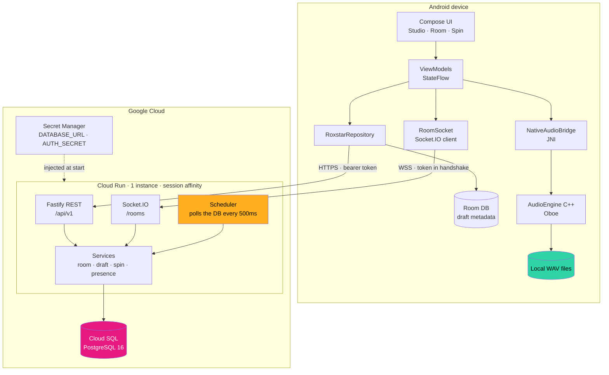
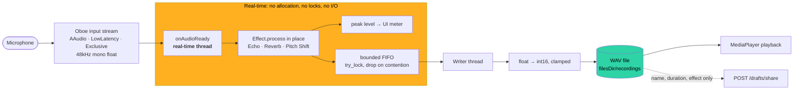
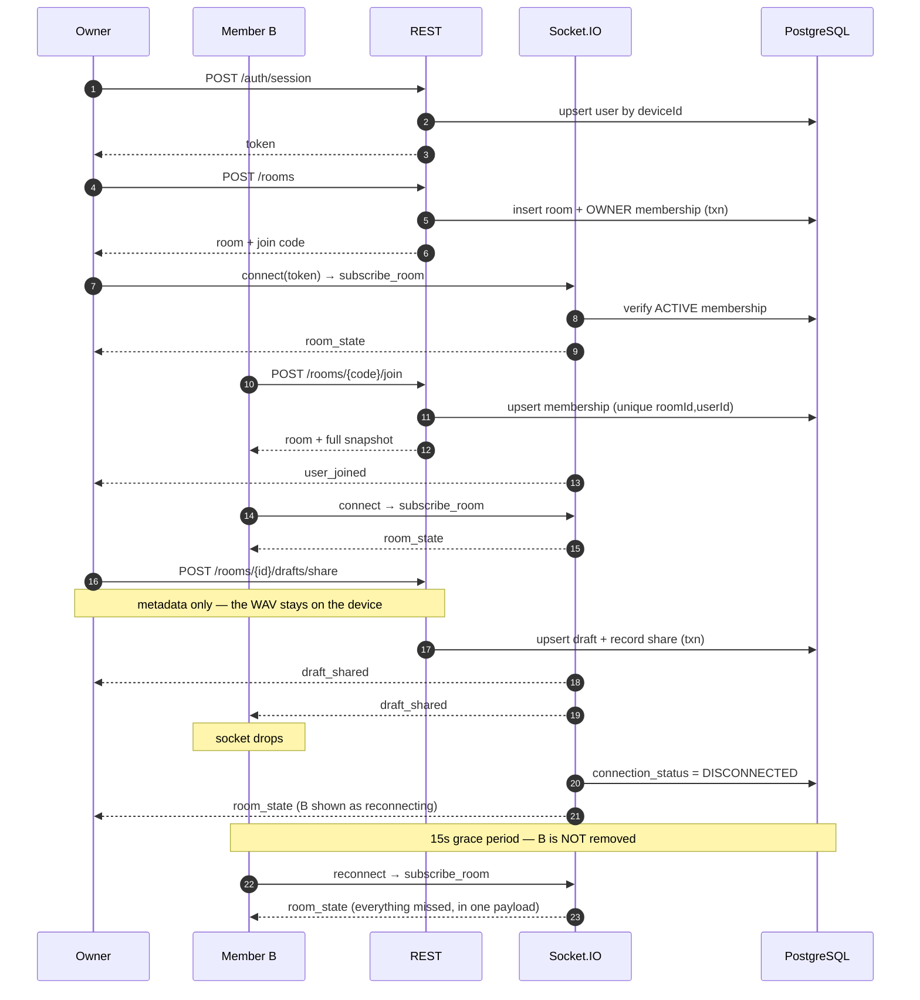
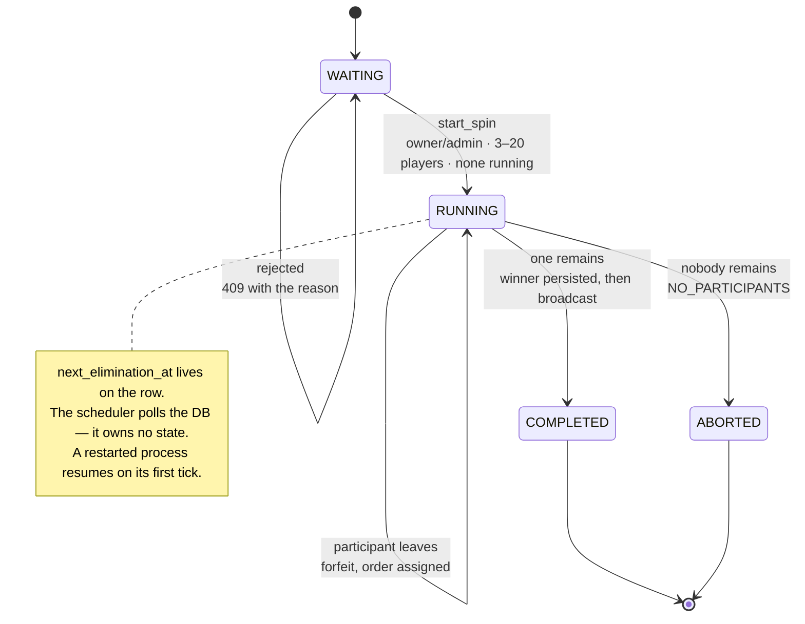
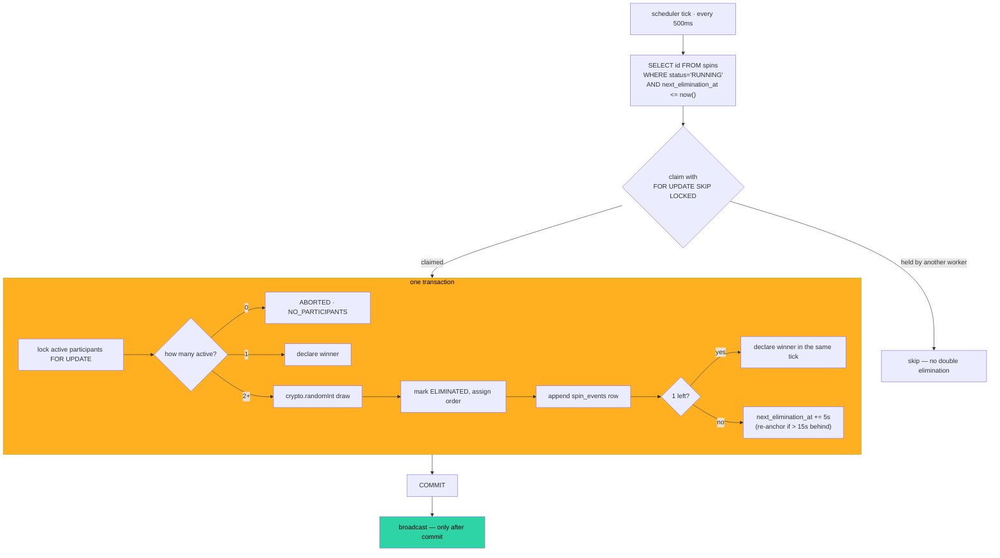
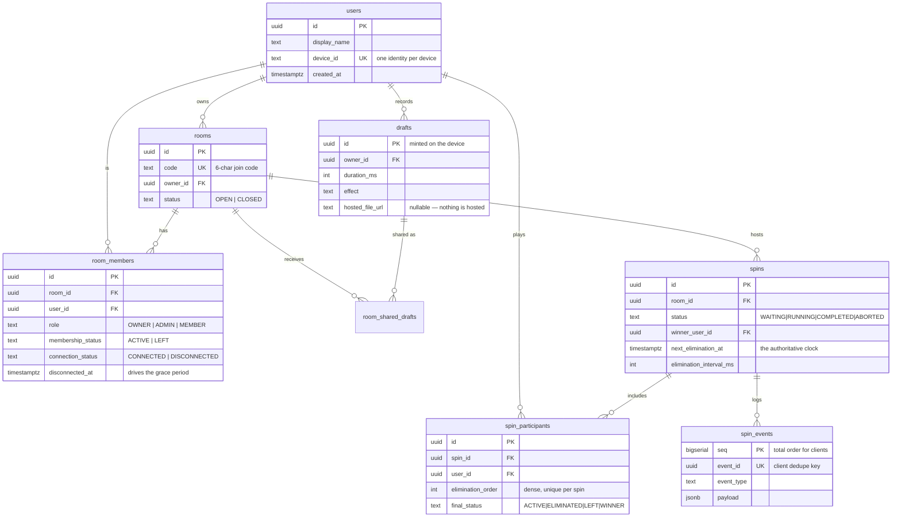

# Architecture

All diagrams are Mermaid, so they render on GitHub and stay diffable — a PNG
would go stale the first time the code changed and nobody would notice.

---

## 1. System architecture



**The two boundaries that matter:**

1. **Audio is local.** The WAV never crosses the network. Sharing a draft sends
   name, duration and effect — nothing else. Live audio streaming is out of
   scope, and the end-to-end suite asserts no event payload contains audio data.

2. **The backend is authoritative.** The client renders spin state; it never
   computes it. No local elimination timer, no local winner.

---

## 2. Audio flow



**Why the writer thread exists.** `fwrite` can block on flash for tens of
milliseconds — far longer than an audio callback deadline. Writing inline is the
classic cause of dropouts, so the callback copies the buffer into a bounded
queue and returns. If the queue is full or the writer holds the lock, the buffer
is dropped: losing one buffer is bad, but blocking the audio thread would glitch
every buffer after it too.

**Effects allocate once**, in `prepare()`, off the audio thread. `process()` only
indexes into buffers that already exist.

### Echo

```
out[n]       = in[n] + feedback · delayLine[n − D]
delayLine[n] = out[n]          ← the mixed signal, not the dry input
```

Feeding the *output* back is what makes the echo repeat and decay rather than
produce a single slap. Each repeat is `feedback` times quieter, so the tail
converges geometrically. Verified by measurement, not inspection: an impulse in,
and the repeats are checked to land one delay period apart at `feedback` and
`feedback²`.

### Pitch shift

Time-domain granular resampling. The read pointer sits `delay` samples behind
the write head, and that delay **ramps** by `1 − pitchRatio` per output frame,
so the read head advances `pitchRatio` input samples per output sample. Two
heads run half a grain apart under complementary periodic Hann windows, which
sum to unity and hide the wrap discontinuity.

> The first version of this ramped the read *position* by `pitchRatio` instead
> of the *delay* by `1 − pitchRatio`. It looked right and reviewed fine. The
> host-side test measured a 440 Hz tone coming out at 440 Hz for a +12-semitone
> shift and 7.8 Hz for a no-op shift. See `native-audio/tests/`.

---

## 3. Room and WebSocket event flow



---

## 4. Spin state machine



### One elimination tick



**Three properties this buys:**

- **No double elimination.** `SKIP LOCKED` means a slow tick is skipped, never
  duplicated. Ten concurrent tick attempts per round still produce exactly N−1
  eliminations — asserted in the concurrency suite.
- **No event without state.** The audit row commits with the state change, and
  the broadcast happens after. A crash can lose a broadcast; it cannot produce
  one the database does not record.
- **Restart is a non-event.** There is no recovery routine to get wrong — a
  fresh process finds `RUNNING` spins on its first ordinary tick.

---

## 5. Database schema



### Constraints that carry business rules

| Rule | Enforced by |
|---|---|
| One active spin per room | `CREATE UNIQUE INDEX ... ON spins(room_id) WHERE status='RUNNING'` |
| No duplicate membership | `UNIQUE (room_id, user_id)` |
| One identity per device | `UNIQUE (device_id)` |
| Dense, unique elimination order | `UNIQUE (spin_id, elimination_order)` |
| A completed spin has a winner | `CHECK (status <> 'COMPLETED' OR winner_user_id IS NOT NULL)` |
| A running spin has a deadline | `CHECK (status <> 'RUNNING' OR next_elimination_at IS NOT NULL)` |
| Client dedupe keys are unique | `UNIQUE (event_id)` |

These live in the database rather than only in application code, so a
refactor of a service cannot corrupt a spin. The partial unique index in
particular is what makes "only one active spin" true under concurrency — the
row lock in `startSpin` is the fast path, and the index is the guarantee.

### Indexes and why

| Index | Serves |
|---|---|
| `spins(next_elimination_at) WHERE status='RUNNING'` | The scheduler's hot query, every 500 ms |
| `room_members(room_id, membership_status)` | Participant list and eligibility count |
| `room_members(disconnected_at) WHERE DISCONNECTED AND ACTIVE` | The presence sweeper |
| `spin_participants(spin_id, final_status)` | "who is still active?" on every tick |
| `spin_events(spin_id, seq)` | Ordered replay of a spin |
| `room_shared_drafts(room_id, shared_at DESC)` | Latest shared draft for `room_state` |
